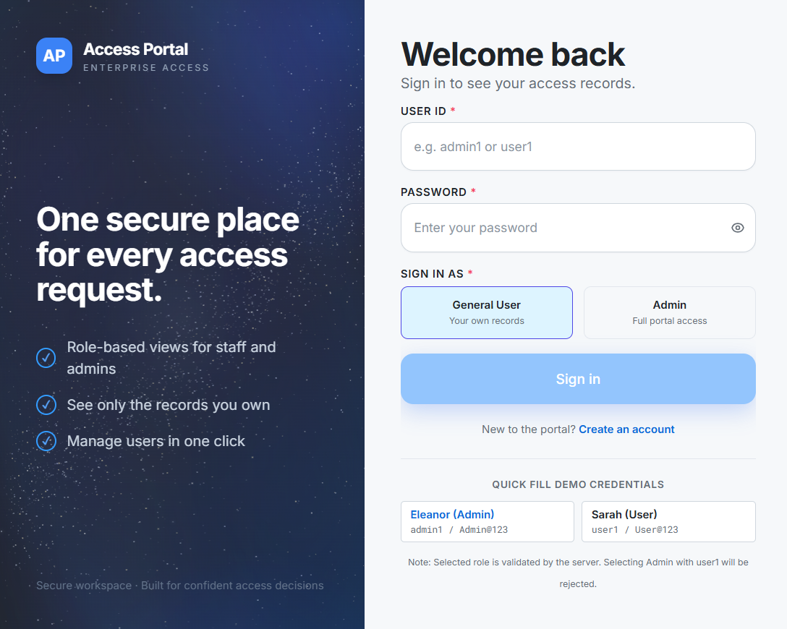
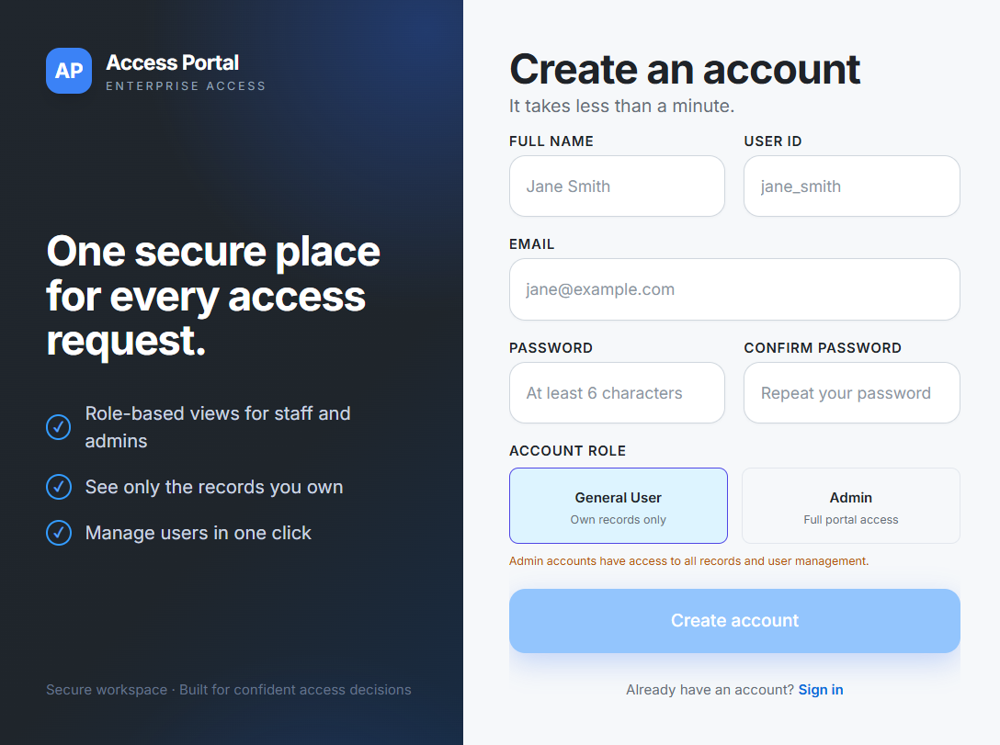
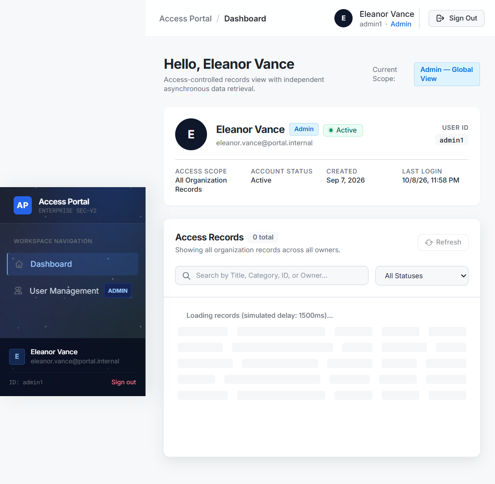
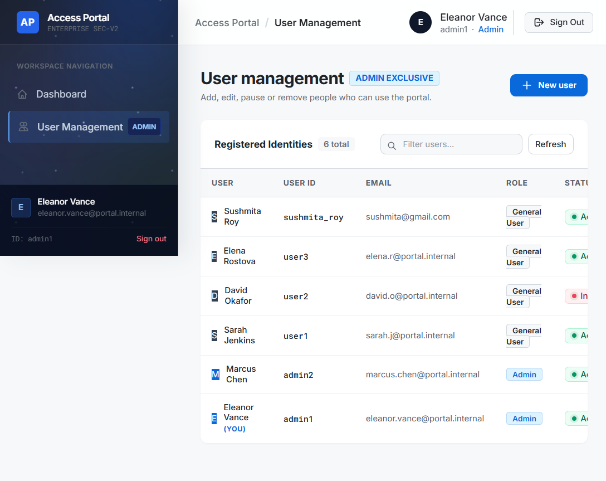

# User Access Portal — Angular SPA

A responsive Single-Page Application (SPA) built with Angular 19, TypeScript, RxJS, and Reactive Forms, supported by a minimal Node.js/Express API and persistent MongoDB storage.

---

## 1. Project Overview & Features

### Website Views (Angular Router)
- **/login**: Clean enterprise sign-in screen featuring User ID, Password, and Role selection (`General User` vs `Admin`), reactive validation messages, password visibility toggle, quick-fill demo buttons, and loading states.
  - **Role Enforcement**: Authenticates against stored credentials and verifies that the selected role strictly matches the user's database role. Selecting `Admin` while possessing a `General User` account is rejected by the server with `403 Forbidden`.
- **/dashboard**: Shared workspace with dark sidebar, header, authenticated user profile card (`name`, `User ID`, `email`, `role`, `status`, `lastLoginAt`), and access-controlled records table.
  - **Ownership Filtering**: General Users view only their own records; Admins see all records across all owners with the `Owner` column visible.
  - Includes search with debouncing and obsolete request cancellation (`switchMap`), status filtering (`All`, `Open`, `In Progress`, `Completed`), pagination, and refresh.
- **/users** (Admin Only): Restricted to Administrators (enforced both via Angular `admin.guard` and backend middleware).
  - Data table with user accounts, active status indicators, creation dates.
  - Dialog modals for creating new users and editing attributes.
  - Soft deletion with confirmation dialog modal (`isDeleted: true`, `status: 'Inactive'`).
  - **Self-Account Protection**: Prevents an Admin from deleting, deactivating, or demoting their own current account.

---

## Visual Walkthrough

### Login Page

The split authentication layout includes the animated galaxy brand panel, role selection, demo credentials, and accessible sign-in form.



### Register Page

The registration flow uses the same branded layout for creating General User or Admin accounts.



### Dashboard Page

The authenticated dashboard presents the user profile, access scope, searchable records, status filters, pagination, and refresh actions.



### User Management Page

Administrators can review users, roles, account status, registration dates, and available account actions.



---

## 2. Asynchronous Loading & API Delay Support

The API supports non-blocking delay simulation for profile (`GET /api/users/me?delayMs=...`) and records (`GET /api/records?delayMs=...`) requests.
- Non-blocking server-side simulated delays (`handleDelaySimulation`).
- **Independent Loading**: The profile card appears immediately as soon as its request finishes, while the records table continues showing an animated loading skeleton until its delay elapses.
- Displays pending, completed, or failed states with actual elapsed execution duration in milliseconds.
- In the event of a records error, the profile remains visible and a records-only retry button is provided.

---

## 3. Demo Credentials

| Role | User ID | Password | Access Scope |
| :--- | :--- | :--- | :--- |
| **Admin** | `admin1` | `Admin@123` | Full portal access, all records, User Management |
| **Admin** | `admin2` | `Admin@123` | Full portal access, all records, User Management |
| **General User** | `user1` | `User@123` | Scoped to Sarah Jenkins' records, no `/users` access |
| **General User** | `user2` | `User@123` | Scoped to David Okafor's records, no `/users` access |
| **General User** | `user3` | `User@123` | Scoped to Elena Rostova's records, no `/users` access |

*Quick-fill demo buttons are provided directly on the `/login` screen for fast testing.*

---

## 4. Setup & Running Instructions

### Prerequisites
- Node.js 18+ (tested on Node 22)
- npm

### Installation & Run
```bash
# 1. Install dependencies
npm install --legacy-peer-deps

# 2. Run the full-stack application (starts Express on port 3000 with Vite middleware)
npm run dev

# 3. Seed database manually (optional, runs automatically on startup if empty)
npm run seed

# 4. Run focused test suite
npm test

# 5. Production Build
npm run build
```

---

## 5. Angular Architecture

```
src/app/
├── core/
│   ├── services/
│   │   ├── auth.service.ts          # Session state, login, logout, CSRF token
│   │   ├── user.service.ts          # Profile retrieval and Admin user CRUD
│   │   ├── record.service.ts        # Access-controlled records retrieval
│   │   └── app-startup.service.ts   # Session restoration on refresh
│   ├── guards/
│   │   ├── auth.guard.ts            # Protects /dashboard and /users
│   │   └── admin.guard.ts           # Protects /users (Admin-only)
│   └── interceptors/
│       ├── csrf.interceptor.ts      # Attaches x-csrf-token and withCredentials
│       └── error.interceptor.ts     # 401 redirect handling
├── layout/
│   ├── app-layout.component.ts      # Common layout with dark sidebar and header
│   ├── header.component.ts          # Top navigation, status indicator, sign-out
│   └── sidebar.component.ts         # Navigation with Admin badge & user footer
├── features/
│   ├── login/
│   │   └── login.component.ts       # Reactive login form with role validation
│   ├── dashboard/
│   │   ├── dashboard.component.ts   # Records table, search, filters, pagination
│   │   ├── delay-demo-panel.component.ts # Independent delay simulation panel
│   │   └── profile-card.component.ts # Decoupled user profile card
│   └── user-management/
│       ├── user-management.component.ts # Admin user list and actions
│       ├── user-dialog.component.ts # Create & edit user modal dialog
│       └── delete-confirm-dialog.component.ts # Soft-deletion confirmation modal
├── shared/
│   ├── components/
│   │   ├── loading-skeleton.component.ts # Shimmer skeleton loader
│   │   └── status-badge.component.ts     # Consistent status badges
│   └── models/
│       ├── user.model.ts            # User, Login, Session interfaces
│       └── record.model.ts          # PortalRecord and query interfaces
└── app.routes.ts                    # Angular routing configuration
```

---

## 6. Test Suite Report

Focused automated integration tests (`npm test` / `tsx tests/runner.ts`) verify:
1. **Authentication**:
   - Valid Admin login with session creation and CSRF token generation
   - Valid General User login
   - Invalid password rejection (`401 Unauthorized`)
   - Role mismatch rejection (`403 Forbidden`) when credentials do not match selected role
   - Session restoration via `GET /api/auth/session`
2. **Role Restrictions**:
   - General User forbidden from `GET /api/users` (`403 Forbidden`)
   - General User forbidden from creating users (`403 Forbidden`)
   - Admin access permitted to `GET /api/users` (`200 OK`)
3. **Record Ownership**:
   - General User only receives records where `ownerId === currentUser.userId`
   - Pagination total count strictly reflects owned records
   - Admin receives global records with owner attribution
4. **Admin Operations & Self-Protection**:
   - Admin creation of new users with MongoDB persistence
   - Protection preventing Admin from deactivating own account (`400 Bad Request`)
   - Protection preventing Admin from demoting own account (`400 Bad Request`)
   - Protection preventing Admin from deleting own account (`400 Bad Request`)
   - Admin soft-deletion of another user (`isDeleted: true`, `status: 'Inactive'`)
5. **Independent Loading**:
   - Non-blocking delay simulation on `GET /api/users/me?delayMs=300`
   - Non-blocking delay simulation on `GET /api/records?delayMs=400`
